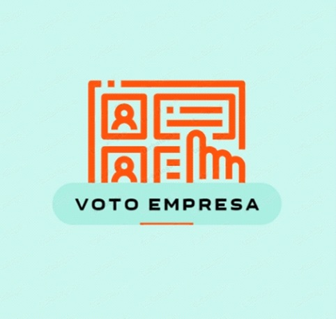

# Projeto de Engenharia de Software I | Fatec

## 💻 Sistema de Eleição da CIPA

> O projeto Voto Empresa é um sistema interligado desenvolvido para as eleições da Comissão
Interna de Prevenção de Acidentes (CIPA) de uma empresa.

### Documentação PDF

- [x] Levantamento de requisitos funcionais, não funcionais e regras de negócio.
- [x] Diagrama de Caso de uso.
- [x] Cenários de Caso de Uso.
- [x] Prototipação.

## 🔎 Analistas de Requisitos

  <a href="https://github.com/Giuliana09">Giuliana |</a>
  <a href="https://github.com/LarissaSL">Larissa |</a>
  <a href="https://github.com/SilvanaMenezes">Silvana</a> 

## 📝 Licença

Esse projeto está sob licença. Veja o arquivo [LICENÇA](LICENSE.md) para mais detalhes.
